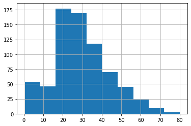
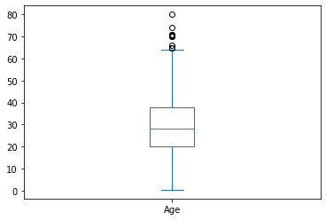
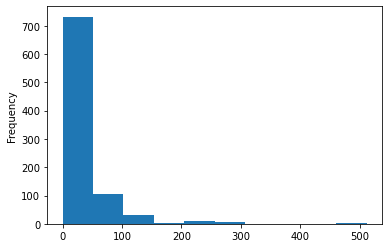
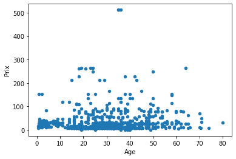
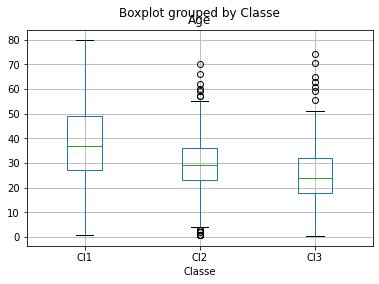
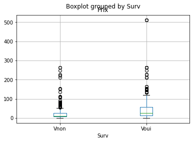
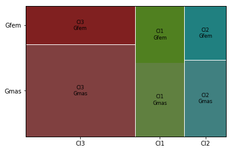
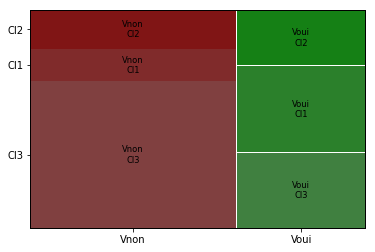

<center></center>

# Introduction à Python pour la Data Science

## Manipulation de données avec Pandas

### <a href="http://pandas.pydata.org/"></a> 

**Résumé**:  Utilisation de Python pour la préparation (*data munging* ou *wrangling* ou trafic) de données pas trop massives: qui tiennent en mémoire une fois réorganisées. Cette étape est abordée par l'initiation aux fonctionnalités de la librairie `pandas` et à la classe `DataFrame`; lire et écrire des fichiers, gérer une table de données et les types des variables, échantillonner, discrétiser, regrouper des modalités, description élémentaires uni et bi-variées; concaténation et jointure de tables.

## 1 Introduction
### 1.1 Objectifs
Le *data munging* ou *wrangling* (traduit ici par *trafic*) de données est l'ensemble des opérations permettant de passer de données brutes à une table (*data frame*) correcte et adaptée aux objectifs à atteindre par des  méthodes statistiques d'analyse, exploration, modélisation ou apprentissage. 

En présence de données complexes, peu ou mal organisées, présentant des trous, trop massives pour tenir en mémoire...  la qualité de cette étape est fondamentale (*garbage in garbage out*) pour la bonne réalisation d'une étude. 

### 1.2 Croissance du volume
Le volume des données et sa croissance occasionnent schématiquement trois situations.
1. Le fichier initial des données brutes peut être chargé  intégralement en mémoire moyennant éventuellement de sauter quelques colonnes ou lignes du fichier (cf. section  3.1). C'est la situation courante, tout logiciel statistique comme R peut réaliser les traitements. 
2. Le fichier initial est très volumineux mais la table (*DataFrame*), qui résulte de quelques  trafics (*munging*) appropriés, tient en mémoire. Cette situations nécessite: lecture, analyse, transformation, ré-écriture, séquentielles du fichier ligne à ligne ou par bloc. Il existe des astuces avec R mais il est préférable d'utiliser des outils plus adaptés. Tout langage de programmation (java, c, perl, ruby...) peut être utilisé pour écrire le ou les programmes réalisant ce travail. Néanmoins Python, et plus précisément la librairie [`pandas`](http://pandas.pydata.org/), offrent un ensemble d'outils efficaces pour accomplir ces tâches sans avoir à ré-inventer la roue et ré-écrire tout un ensemble de fonctionnalités relativement basiques. 
Remarque : les procédures `univariate` et `freq` et l'étape `data` de SAS sont adaptées car elles ne chargent pas les données en mémoire pour réaliser des traitements rudimentaires. Néanmoins pour tout un tas de raisons, notamment de coût annuel de location, SAS perd régulièrement des parts de marché sur ce créneau. 
3. Lorsque les données, très massives, sont archivées sur un système de données distribuées (*Hadoop Distributed File System* ou HDFS), trafic et prétraitement des données doivent tenir compte de cet environnement. L'environnement *Spark* et l'API `PySpark` permettant de gérer en python des données distribuées est à favoriser.

### 1.3 Quelques problèmes
Liste non exhaustive des problèmes pouvant être rencontrés et dont la résolution nécessite simultanément des compétences en Informatique, Statistique, Mathématiques et aussi "métier" du domaine de l'étude. 
-  Identifier les "individus" $\times$ "variables" (*instances*$\times$*features* en langue informatique) de la table à mettre en forme à partir de bases de données variées; *i.e.* logs d'un site web, listes d'incidents, localisations...
- Donnés atypiques (*outliers*): correction, suppression, transformation des variables
- Variable qualitative avec beaucoup de modalités dont certaines très peu fréquentes: suppression, modalité `autres`, recodage aléatoire, regroupement "métier"
- Données manquantes: suppressions (ligne ou colonne), imputation de valeurs...
- Représentations (splines, Fourier, ondelettes) et recalage (*time warping*) de données fonctionnelles.
- Représentation de trajectoires, de chemins sur un graphe (routage des paquets de données dans un réseau, découverte du chemin le plus court pour aller d'une ville à une autre) 
- Choix d'une distance (quadratique, absolue, géodésique...) entre les objets étudiés.
- ...
Bien entendu les "bons" choix dépendent directement de l'objectif poursuivi et des méthodes mises en oeuvre par la suite. D'où l'importance d'intégrer de façon précoce, dès la planification du recueil des données, les compétences statistiques nécessaires au sein d'une équipe. 
### 1.4 Fonctionnalités de `pandas`
La richesse des fonctionnalités de la librairie `pandas` est une des raisons, si ce n'est la principale,  d'utiliser Python pour extraire, préparer, éventuellement analyser, des données. En voici un bref aperçu. 
- *Objets*: les classes `Series` et `DataFrame` ou *table de données*.
- *Lire, écrire* création et exportation de tables de données à partir de fichiers textes (séparateurs, `.csv`, format fixe, compressés), binaires (HDF5 avec `Pytable`), HTML, XML, JSON, MongoDB, SQL... 
- *Gestion*  d'une table: sélection des lignes, colonnes, transformations, réorganisation par niveau d'un facteur, discrétisation de variables quantitatives, exclusion ou imputation élémentaire de données manquantes, permutation et échantillonnage aléatoire, variables indicatrices, chaînes de caractères...
- *Statistiques* élémentaires  uni et bivariées, tri à plat (nombre de modalités, de valeurs nulles, de valeurs manquantes...), graphiques associés, statistiques par groupe, détection élémentaire de valeurs atypiques...
- *Manipulation* de tables: concaténations, fusions, jointures, tri, gestion des types et formats...
### 1.5 Références
Ce tutoriel élémentaire s'inspire largement du livre de référence (Mc Kinney, 2013) et de la [documentation en ligne](http://pandas.pydata.org/pandas-docs/stable/) à consulter sans modération. Cette documentation inclut également des [tutoriels](http://pandas.pydata.org/pandas-docs/stable/tutorials.html) à exécuter pour compléter et approfondir la première ébauche d'un sujet relativement technique et qui peut prendre des tournures très diverses en fonction de la qualité et des types de données traitées.


## 2 Les classes `Series` et `DataFrame`
De même que la librairie `Numpy` introduit le type `array` indispensable à la manipulation de matrices en calcul scientifique, celle `pandas` introduit les classes `Series` (séries chronologiques) et  `DataFrame` ou table de données indispensables en statistique. 

### 2.1 *Series*
La classe `Series` est l'association de deux `arrays` unidimensionnels. Le premier est un ensemble de valeurs indexées par le 2ème qui est souvent une série temporelle.  Ce type est introduit principalement pour des applications en Econométrie et Finance où Python est largement utilisé.

### 2.2 *DataFrame*
Cette classe est proche de celle du même nom dans le langage R, il s'agit d'associer avec le même index de lignes des colonnes ou variables de types différents (entier, réel, booléen, caractère). C'est un tableau bi-dimensionnel avec des index de lignes et de colonnes mais il peut également être vu comme une liste de `Series` partageant le même index. L'index de colonne (noms des variables) est un objet de type `dict` (dictionnaire). C'est la classe qui sera principalement utilisée dans ce tutoriel. 


```python
# Exemple de data frame
import pandas as pd
data = {"state": ["Ohio", "Ohio", "Ohio", 
       "Nevada", "Nevada"],
     "year": [2000, 2001, 2002, 2001, 2002],
     "pop": [1.5, 1.7, 3.6, 2.4, 2.9]}
frame = pd.DataFrame(data)
# ordre des colonnes
pd.DataFrame(data, columns=["year", "state", "pop"])
```


```python
# index des lignes et valeurs manquantes (NaN)
frame2=pd.DataFrame(data, columns=["year", "state", "pop", "debt"],
     index=["one", "two", "three", "four", "five"])
# liste des colonnes
frame.columns
```


    Index(['state', 'year', 'pop'], dtype='object')


```python
# valeurs d'une colonnes
frame["state"]
```


    0      Ohio
    1      Ohio
    2      Ohio
    3    Nevada
    4    Nevada
    Name: state, dtype: object


```python
frame.year
```


```python
# "imputation"
frame2["debt"] = 16.5
frame2
```


<div>
<style scoped>
    .dataframe tbody tr th:only-of-type {
        vertical-align: middle;
    }

    .dataframe tbody tr th {
        vertical-align: top;
    }

    .dataframe thead th {
        text-align: right;
    }
</style>
<table border="1" class="dataframe">
  <thead>
    <tr style="text-align: right;">
      <th></th>
      <th>year</th>
      <th>state</th>
      <th>pop</th>
      <th>debt</th>
    </tr>
  </thead>
  <tbody>
    <tr>
      <th>one</th>
      <td>2000</td>
      <td>Ohio</td>
      <td>1.5</td>
      <td>16.5</td>
    </tr>
    <tr>
      <th>two</th>
      <td>2001</td>
      <td>Ohio</td>
      <td>1.7</td>
      <td>16.5</td>
    </tr>
    <tr>
      <th>three</th>
      <td>2002</td>
      <td>Ohio</td>
      <td>3.6</td>
      <td>16.5</td>
    </tr>
    <tr>
      <th>four</th>
      <td>2001</td>
      <td>Nevada</td>
      <td>2.4</td>
      <td>16.5</td>
    </tr>
    <tr>
      <th>five</th>
      <td>2002</td>
      <td>Nevada</td>
      <td>2.9</td>
      <td>16.5</td>
    </tr>
  </tbody>
</table>
</div>


```python
# créer une  variable
frame2["eastern"] = frame2.state == "Ohio"
frame2
```


<div>
<style scoped>
    .dataframe tbody tr th:only-of-type {
        vertical-align: middle;
    }

    .dataframe tbody tr th {
        vertical-align: top;
    }

    .dataframe thead th {
        text-align: right;
    }
</style>
<table border="1" class="dataframe">
  <thead>
    <tr style="text-align: right;">
      <th></th>
      <th>year</th>
      <th>state</th>
      <th>pop</th>
      <th>debt</th>
      <th>eastern</th>
    </tr>
  </thead>
  <tbody>
    <tr>
      <th>one</th>
      <td>2000</td>
      <td>Ohio</td>
      <td>1.5</td>
      <td>16.5</td>
      <td>True</td>
    </tr>
    <tr>
      <th>two</th>
      <td>2001</td>
      <td>Ohio</td>
      <td>1.7</td>
      <td>16.5</td>
      <td>True</td>
    </tr>
    <tr>
      <th>three</th>
      <td>2002</td>
      <td>Ohio</td>
      <td>3.6</td>
      <td>16.5</td>
      <td>True</td>
    </tr>
    <tr>
      <th>four</th>
      <td>2001</td>
      <td>Nevada</td>
      <td>2.4</td>
      <td>16.5</td>
      <td>False</td>
    </tr>
    <tr>
      <th>five</th>
      <td>2002</td>
      <td>Nevada</td>
      <td>2.9</td>
      <td>16.5</td>
      <td>False</td>
    </tr>
  </tbody>
</table>
</div>


```python
frame2.columns
```


    Index(['year', 'state', 'pop', 'debt', 'eastern'], dtype='object')


```python
# supprimer une  variable
del frame2[u"eastern"]
frame2.columns
```


    Index(['year', 'state', 'pop', 'debt'], dtype='object')


### 2.3 Index
Les index peuvent être définis par emboîtement et beaucoup d'autres fonctionnalités sur la gestion des index sont décrites par Mac Kinney (2013) (chapitre 5): 
- `append` nouvel index par concaténation,
- `diff` différence ensembliste,
- `intersection` intersection ensembliste,
- `union` union ensembliste
- `isin` vrai si la valeur est dans la liste,
- `delete` suppression de l'index $i$,
- `drop` suppression d'une valeur d'index, 
- `is_monotonic` vrai si les valeurs sont croissantes, 
- `is_unique` vrai si toutes les valeurs sont différentes, 
- `unique` tableau des valeurs uniques de l'index.

## 3 Lire écrire des tables de données
`Pandas` offre des outils efficaces pour lire écrire des fichiers selon différents formats (csv, texte, fixe, compressé, xml, html, hdf5) ou interagir avec des bases de données SQL, MongoDB, des APIs web. Ce document se contente de décrire les fonctions les plus utiles `read_csv` et `read_table` pour lire des fichiers textes et générer un objet de classe ` DataFrame`. 

En principe ces fonctions font appel à un code écrit en C dont très rapide à l'exécution sauf pour l'emploi de certaines options (`skip\_footer, sep`} autre qu'un seul caractère), à éviter, qui provoquent une exécution en Python (`engine=Python`). 

La réciproque pour l'écriture est obtenue par les commandes `data.to_csv` ou `_table` avec des options similaires. 

### 3.1 Syntaxe
L'exemple de base est donné pour lire un fichier au format `.csv` dont les valeurs sont séparées par des "," et dont la première ligne contient le nom des variables.
``
import pandas as pd
data=pd.read_csv("fichier.csv")
data=pd.read_table("fichier.csv", sep=",")
``

Il est important de connaître la liste des possibilités et options offertes par cette simple commande. Voici les principales ci-dessous et un lien à la [liste complète](http://pandas.pydata.org/pandas-docs/stable/io.html#io-read-csv-table).
- `path` chemin ou non du fichier ou URL.
- `sep` délimiteur comme ",", ";", "\t" ou "\s+" #  pour un nombre variable d'espaces. 
- `header` défaut 0, la première ligne contient le nom des variables; si `None` les noms sont générés ou définis par ailleurs.
- `index_col` noms ou numéros de colonnes définissant les index de lignes.
- `names` si {header=None}, liste des noms des variables. 
- `nrows` utile pour tester et limiter le nombre de ligne à lire.
- `skiprow` liste de lignes à sauter en lecture.
- `skip_footer` nombre de lignes à sauter en fin de fichier.
- `na_values` définition du ou des codes signalant des valeurs manquantes. Ils peuvent être définis dans un dictionnaire pour associer variables et codes de valeurs manquantes spécifiques.
- `usecols` sélectionne une liste des variable à lire pour éviter de lire des champs ou variables volumineuses et inutiles.
- `skip_blan_lines` à `True` pour sauter les lignes blanches.
- `converters` appliquer une fonction à une colonne ou variable. # {'date':pd.to_datetime}
- `day_first` par défaut `False`, pour des dates françaises au format `7/06/2013`.
- `chunksize` taille des morceaux à lire itérativement.
- `verbose` imprime des informations comme le nombre de valeurs manquantes des variables non numériques.
- `encoding` type d'encodage comme "utf-8" ou "latin-1"
- `thousand` séparateur des miliers: "." ou ",".

Remarques:
- De nombreuses options de gestion des dates et séries ne sont pas citées.
- `chunksize` provoque la lecture d'un gros fichiers par morceaux de même taille (nombre de lignes). Des fonctions (comptage, dénombrement...) peuvent ensuite s'appliquer itérativement sur les morceaux.


### 3.2 Exemple pratique : Titanic

Les données choisies pour illustrer ce tutoriel sont issues d'une compétition du site [Kaggle](https://www.kaggle.com/): [Titanic: Machine learnic from Disaster](https://www.kaggle.com/c/titanic-gettingStarted). Le concours est terminé mais les [données](https://www.kaggle.com/c/titanic-gettingStarted/data) sont toujours disponibles sur le site avec des tutoriels utilisant Excel, Python ou R. 

Une des raisons du drame, qui provoqua la mort de 1502 personnes sur les 2224 passagers et membres d'équipage, fut le manque de canots de sauvetage. Il apparaît que les chances de survie dépendaient de différents facteurs (sexe, âge, classe...). Le but du concours est de construire un modèle de prévision (classification supervisée) de survie en fonction de ces facteurs. Les données sont composées d'un échantillon d'apprentissage (891) et d'un échantillon test (418) chacun décrit par 11 variables dont la première indiquant la survie ou non lors du naufrage. 

Vous trouverez ci-dessous la liste des variables du dataset.

Label  | Intitulé
----------|-------------
survival   |     Survival (0 = No; 1 = Yes)
pclass   |       Passenger Class (1 = 1st; 2 = 2nd; 3 = 3rd)
name    |       Name
sex     |        Sex
age     |        Age
sibsp   |        Number of Siblings/Spouses Aboard
parch    |       Number of Parents/Children Aboard
ticket   |       Ticket Number
fare    |        Passenger Fare
cabin   |        Cabin
embarked |       Port of Embarkation (C = Cherbourg; Q = Queenstown; S = Southampton)


```python
# Importations
import pandas as pd
import numpy as np
# tester la lecture
df = pd.read_csv('../99 - Datasets/titanic-train.csv',nrows=5)
df
```


<div>
<style scoped>
    .dataframe tbody tr th:only-of-type {
        vertical-align: middle;
    }

    .dataframe tbody tr th {
        vertical-align: top;
    }

    .dataframe thead th {
        text-align: right;
    }
</style>
<table border="1" class="dataframe">
  <thead>
    <tr style="text-align: right;">
      <th></th>
      <th>PassengerId</th>
      <th>Survived</th>
      <th>Pclass</th>
      <th>Name</th>
      <th>Sex</th>
      <th>Age</th>
      <th>SibSp</th>
      <th>Parch</th>
      <th>Ticket</th>
      <th>Fare</th>
      <th>Cabin</th>
      <th>Embarked</th>
    </tr>
  </thead>
  <tbody>
    <tr>
      <th>0</th>
      <td>1</td>
      <td>0</td>
      <td>3</td>
      <td>Braund, Mr. Owen Harris</td>
      <td>male</td>
      <td>22</td>
      <td>1</td>
      <td>0</td>
      <td>A/5 21171</td>
      <td>7.2500</td>
      <td>NaN</td>
      <td>S</td>
    </tr>
    <tr>
      <th>1</th>
      <td>2</td>
      <td>1</td>
      <td>1</td>
      <td>Cumings, Mrs. John Bradley (Florence Briggs Th...</td>
      <td>female</td>
      <td>38</td>
      <td>1</td>
      <td>0</td>
      <td>PC 17599</td>
      <td>71.2833</td>
      <td>C85</td>
      <td>C</td>
    </tr>
    <tr>
      <th>2</th>
      <td>3</td>
      <td>1</td>
      <td>3</td>
      <td>Heikkinen, Miss. Laina</td>
      <td>female</td>
      <td>26</td>
      <td>0</td>
      <td>0</td>
      <td>STON/O2. 3101282</td>
      <td>7.9250</td>
      <td>NaN</td>
      <td>S</td>
    </tr>
    <tr>
      <th>3</th>
      <td>4</td>
      <td>1</td>
      <td>1</td>
      <td>Futrelle, Mrs. Jacques Heath (Lily May Peel)</td>
      <td>female</td>
      <td>35</td>
      <td>1</td>
      <td>0</td>
      <td>113803</td>
      <td>53.1000</td>
      <td>C123</td>
      <td>S</td>
    </tr>
    <tr>
      <th>4</th>
      <td>5</td>
      <td>0</td>
      <td>3</td>
      <td>Allen, Mr. William Henry</td>
      <td>male</td>
      <td>35</td>
      <td>0</td>
      <td>0</td>
      <td>373450</td>
      <td>8.0500</td>
      <td>NaN</td>
      <td>S</td>
    </tr>
  </tbody>
</table>
</div>


```python
df.tail()
```


<div>
<style scoped>
    .dataframe tbody tr th:only-of-type {
        vertical-align: middle;
    }

    .dataframe tbody tr th {
        vertical-align: top;
    }

    .dataframe thead th {
        text-align: right;
    }
</style>
<table border="1" class="dataframe">
  <thead>
    <tr style="text-align: right;">
      <th></th>
      <th>PassengerId</th>
      <th>Survived</th>
      <th>Pclass</th>
      <th>Name</th>
      <th>Sex</th>
      <th>Age</th>
      <th>SibSp</th>
      <th>Parch</th>
      <th>Ticket</th>
      <th>Fare</th>
      <th>Cabin</th>
      <th>Embarked</th>
    </tr>
  </thead>
  <tbody>
    <tr>
      <th>0</th>
      <td>1</td>
      <td>0</td>
      <td>3</td>
      <td>Braund, Mr. Owen Harris</td>
      <td>male</td>
      <td>22</td>
      <td>1</td>
      <td>0</td>
      <td>A/5 21171</td>
      <td>7.2500</td>
      <td>NaN</td>
      <td>S</td>
    </tr>
    <tr>
      <th>1</th>
      <td>2</td>
      <td>1</td>
      <td>1</td>
      <td>Cumings, Mrs. John Bradley (Florence Briggs Th...</td>
      <td>female</td>
      <td>38</td>
      <td>1</td>
      <td>0</td>
      <td>PC 17599</td>
      <td>71.2833</td>
      <td>C85</td>
      <td>C</td>
    </tr>
    <tr>
      <th>2</th>
      <td>3</td>
      <td>1</td>
      <td>3</td>
      <td>Heikkinen, Miss. Laina</td>
      <td>female</td>
      <td>26</td>
      <td>0</td>
      <td>0</td>
      <td>STON/O2. 3101282</td>
      <td>7.9250</td>
      <td>NaN</td>
      <td>S</td>
    </tr>
    <tr>
      <th>3</th>
      <td>4</td>
      <td>1</td>
      <td>1</td>
      <td>Futrelle, Mrs. Jacques Heath (Lily May Peel)</td>
      <td>female</td>
      <td>35</td>
      <td>1</td>
      <td>0</td>
      <td>113803</td>
      <td>53.1000</td>
      <td>C123</td>
      <td>S</td>
    </tr>
    <tr>
      <th>4</th>
      <td>5</td>
      <td>0</td>
      <td>3</td>
      <td>Allen, Mr. William Henry</td>
      <td>male</td>
      <td>35</td>
      <td>0</td>
      <td>0</td>
      <td>373450</td>
      <td>8.0500</td>
      <td>NaN</td>
      <td>S</td>
    </tr>
  </tbody>
</table>
</div>


```python
# tout lire
df = pd.read_csv("../99 - Datasets/titanic-train.csv")
df.head()
```


<div>
<style scoped>
    .dataframe tbody tr th:only-of-type {
        vertical-align: middle;
    }

    .dataframe tbody tr th {
        vertical-align: top;
    }

    .dataframe thead th {
        text-align: right;
    }
</style>
<table border="1" class="dataframe">
  <thead>
    <tr style="text-align: right;">
      <th></th>
      <th>PassengerId</th>
      <th>Survived</th>
      <th>Pclass</th>
      <th>Name</th>
      <th>Sex</th>
      <th>Age</th>
      <th>SibSp</th>
      <th>Parch</th>
      <th>Ticket</th>
      <th>Fare</th>
      <th>Cabin</th>
      <th>Embarked</th>
    </tr>
  </thead>
  <tbody>
    <tr>
      <th>0</th>
      <td>1</td>
      <td>0</td>
      <td>3</td>
      <td>Braund, Mr. Owen Harris</td>
      <td>male</td>
      <td>22.0</td>
      <td>1</td>
      <td>0</td>
      <td>A/5 21171</td>
      <td>7.2500</td>
      <td>NaN</td>
      <td>S</td>
    </tr>
    <tr>
      <th>1</th>
      <td>2</td>
      <td>1</td>
      <td>1</td>
      <td>Cumings, Mrs. John Bradley (Florence Briggs Th...</td>
      <td>female</td>
      <td>38.0</td>
      <td>1</td>
      <td>0</td>
      <td>PC 17599</td>
      <td>71.2833</td>
      <td>C85</td>
      <td>C</td>
    </tr>
    <tr>
      <th>2</th>
      <td>3</td>
      <td>1</td>
      <td>3</td>
      <td>Heikkinen, Miss. Laina</td>
      <td>female</td>
      <td>26.0</td>
      <td>0</td>
      <td>0</td>
      <td>STON/O2. 3101282</td>
      <td>7.9250</td>
      <td>NaN</td>
      <td>S</td>
    </tr>
    <tr>
      <th>3</th>
      <td>4</td>
      <td>1</td>
      <td>1</td>
      <td>Futrelle, Mrs. Jacques Heath (Lily May Peel)</td>
      <td>female</td>
      <td>35.0</td>
      <td>1</td>
      <td>0</td>
      <td>113803</td>
      <td>53.1000</td>
      <td>C123</td>
      <td>S</td>
    </tr>
    <tr>
      <th>4</th>
      <td>5</td>
      <td>0</td>
      <td>3</td>
      <td>Allen, Mr. William Henry</td>
      <td>male</td>
      <td>35.0</td>
      <td>0</td>
      <td>0</td>
      <td>373450</td>
      <td>8.0500</td>
      <td>NaN</td>
      <td>S</td>
    </tr>
  </tbody>
</table>
</div>


```python
# Des variables sont inexploitables
# Choisir les colonnes utiles
df=pd.read_csv("../99 - Datasets/titanic-train.csv",
    usecols=[1,2,4,5,6,7,9,11],nrows=5)
df.head()
```


<div>
<style scoped>
    .dataframe tbody tr th:only-of-type {
        vertical-align: middle;
    }

    .dataframe tbody tr th {
        vertical-align: top;
    }

    .dataframe thead th {
        text-align: right;
    }
</style>
<table border="1" class="dataframe">
  <thead>
    <tr style="text-align: right;">
      <th></th>
      <th>Survived</th>
      <th>Pclass</th>
      <th>Sex</th>
      <th>Age</th>
      <th>SibSp</th>
      <th>Parch</th>
      <th>Fare</th>
      <th>Embarked</th>
    </tr>
  </thead>
  <tbody>
    <tr>
      <th>0</th>
      <td>0</td>
      <td>3</td>
      <td>male</td>
      <td>22</td>
      <td>1</td>
      <td>0</td>
      <td>7.2500</td>
      <td>S</td>
    </tr>
    <tr>
      <th>1</th>
      <td>1</td>
      <td>1</td>
      <td>female</td>
      <td>38</td>
      <td>1</td>
      <td>0</td>
      <td>71.2833</td>
      <td>C</td>
    </tr>
    <tr>
      <th>2</th>
      <td>1</td>
      <td>3</td>
      <td>female</td>
      <td>26</td>
      <td>0</td>
      <td>0</td>
      <td>7.9250</td>
      <td>S</td>
    </tr>
    <tr>
      <th>3</th>
      <td>1</td>
      <td>1</td>
      <td>female</td>
      <td>35</td>
      <td>1</td>
      <td>0</td>
      <td>53.1000</td>
      <td>S</td>
    </tr>
    <tr>
      <th>4</th>
      <td>0</td>
      <td>3</td>
      <td>male</td>
      <td>35</td>
      <td>0</td>
      <td>0</td>
      <td>8.0500</td>
      <td>S</td>
    </tr>
  </tbody>
</table>
</div>


À partir de la version 0.15, `pandas`, inclut un type `category` assez proche de celui ` factor` de R. Il devrait normalement être déclaré dans un dictionnaire au moment par exemple de la lecture (`dtype={"Surv":pd.Categorical...}`) mais ce n'est pas le cas, c'est donc le type objet qui est déclaré puis modifié. Il est vivement recommandé de bien affecter les bons types à chaque variable ne serait-ce que pour éviter de faire des opérations douteuses, par exemple arithmétiques sur des codes de modalités.


```python
df=pd.read_csv("../99 - Datasets/titanic-train.csv",skiprows=1,header=None,usecols=[1,2,4,5,9,11],
  names=["Surv","Classe","Genre","Age","Prix","Port"],dtype={"Surv":object,
    "Classe":object,"Genre":object,"Port":object})
df.head()
```


<div>
<style scoped>
    .dataframe tbody tr th:only-of-type {
        vertical-align: middle;
    }

    .dataframe tbody tr th {
        vertical-align: top;
    }

    .dataframe thead th {
        text-align: right;
    }
</style>
<table border="1" class="dataframe">
  <thead>
    <tr style="text-align: right;">
      <th></th>
      <th>Surv</th>
      <th>Classe</th>
      <th>Genre</th>
      <th>Age</th>
      <th>Prix</th>
      <th>Port</th>
    </tr>
  </thead>
  <tbody>
    <tr>
      <th>0</th>
      <td>0</td>
      <td>3</td>
      <td>male</td>
      <td>22.0</td>
      <td>7.2500</td>
      <td>S</td>
    </tr>
    <tr>
      <th>1</th>
      <td>1</td>
      <td>1</td>
      <td>female</td>
      <td>38.0</td>
      <td>71.2833</td>
      <td>C</td>
    </tr>
    <tr>
      <th>2</th>
      <td>1</td>
      <td>3</td>
      <td>female</td>
      <td>26.0</td>
      <td>7.9250</td>
      <td>S</td>
    </tr>
    <tr>
      <th>3</th>
      <td>1</td>
      <td>1</td>
      <td>female</td>
      <td>35.0</td>
      <td>53.1000</td>
      <td>S</td>
    </tr>
    <tr>
      <th>4</th>
      <td>0</td>
      <td>3</td>
      <td>male</td>
      <td>35.0</td>
      <td>8.0500</td>
      <td>S</td>
    </tr>
  </tbody>
</table>
</div>


```python
df.dtypes
```


    Surv       object
    Classe     object
    Genre      object
    Age       float64
    Prix      float64
    Port       object
    dtype: object


Redéfinition des bons types.


```python
df["Surv"]=pd.Categorical(df["Surv"],ordered=False)
df["Classe"]=pd.Categorical(df["Classe"],ordered=False)
df["Genre"]=pd.Categorical(df["Genre"],ordered=False)
df["Port"]=pd.Categorical(df["Port"],ordered=False)
df.dtypes
```


    Surv      category
    Classe    category
    Genre     category
    Age        float64
    Prix       float64
    Port      category
    dtype: object


Remarque: il est également possible de tout lire avant de laisser "tomber" les variable inexploitables. C'est le rôle de la commande: 

`df = df.drop(["Name", "Ticket", "Cabin"], axis=1)`

### 3.3 Echantillonnage simple
Comme dans R, le type `DataFrame` de Python est chargé en mémoire. Si, malgré les options précédentes permettant de sélectionner, les colonnes, les types des variables... le fichier est encore trop gros, il reste possible, avant de chercher une configuration matérielle lourde et en première approximation, de tirer un échantillon aléatoire simple selon une distribution uniforme. Un tirage stratifié demanderait plus de travail. Cela suppose de connaître le nombre de ligne du fichier ou une valeur inférieure proche.


```python
# pour les données titanic:
N=891  # taille du fichier
n=200  # taille de l'échantillon
lin2skipe=[0] # ne pas lire la première ligne
# ne pas lire N-n lignes tirées aléatoirement
lin2skipe.extend(np.random.choice(np.arange(1,N+1),
    (N-n),replace=False))
df_small=pd.read_csv("../99 - Datasets/titanic-train.csv",
    skiprows=lin2skipe,header=None, 
    usecols=[1,2,4,5,9,11],
    names=["Surv","Classe","Genre","Age",
         "Prix","Port"])
df_small
```


<div>
<style scoped>
    .dataframe tbody tr th:only-of-type {
        vertical-align: middle;
    }

    .dataframe tbody tr th {
        vertical-align: top;
    }

    .dataframe thead th {
        text-align: right;
    }
</style>
<table border="1" class="dataframe">
  <thead>
    <tr style="text-align: right;">
      <th></th>
      <th>Surv</th>
      <th>Classe</th>
      <th>Genre</th>
      <th>Age</th>
      <th>Prix</th>
      <th>Port</th>
    </tr>
  </thead>
  <tbody>
    <tr>
      <th>0</th>
      <td>0</td>
      <td>1</td>
      <td>male</td>
      <td>54.0</td>
      <td>51.8625</td>
      <td>S</td>
    </tr>
    <tr>
      <th>1</th>
      <td>1</td>
      <td>3</td>
      <td>female</td>
      <td>4.0</td>
      <td>16.7000</td>
      <td>S</td>
    </tr>
    <tr>
      <th>2</th>
      <td>0</td>
      <td>3</td>
      <td>male</td>
      <td>20.0</td>
      <td>8.0500</td>
      <td>S</td>
    </tr>
    <tr>
      <th>3</th>
      <td>1</td>
      <td>2</td>
      <td>male</td>
      <td>34.0</td>
      <td>13.0000</td>
      <td>S</td>
    </tr>
    <tr>
      <th>4</th>
      <td>1</td>
      <td>3</td>
      <td>female</td>
      <td>NaN</td>
      <td>7.8792</td>
      <td>Q</td>
    </tr>
    <tr>
      <th>...</th>
      <td>...</td>
      <td>...</td>
      <td>...</td>
      <td>...</td>
      <td>...</td>
      <td>...</td>
    </tr>
    <tr>
      <th>195</th>
      <td>1</td>
      <td>3</td>
      <td>male</td>
      <td>4.0</td>
      <td>11.1333</td>
      <td>S</td>
    </tr>
    <tr>
      <th>196</th>
      <td>0</td>
      <td>1</td>
      <td>male</td>
      <td>33.0</td>
      <td>5.0000</td>
      <td>S</td>
    </tr>
    <tr>
      <th>197</th>
      <td>0</td>
      <td>3</td>
      <td>male</td>
      <td>47.0</td>
      <td>9.0000</td>
      <td>S</td>
    </tr>
    <tr>
      <th>198</th>
      <td>0</td>
      <td>3</td>
      <td>female</td>
      <td>39.0</td>
      <td>29.1250</td>
      <td>Q</td>
    </tr>
    <tr>
      <th>199</th>
      <td>0</td>
      <td>3</td>
      <td>male</td>
      <td>32.0</td>
      <td>7.7500</td>
      <td>Q</td>
    </tr>
  </tbody>
</table>
<p>200 rows × 6 columns</p>
</div>


## 4 Gérer une table de données
### 4.1 Discrétisation d'une variable quantitative
Pour la discrétisation d'une variable quantitative. Il est d'un bon usage de définir les bornes des classes à des quantiles, plutôt qu'également espacées, afin de construire des classes d'effectifs sensiblement égaux.  Ceci est obtenu par la fonction `qcut`. La fonction `cut` propose par défaut des bornes équi-réparties à moins de fournir une liste de ces bornes.


```python
df["AgeQ"]=pd.qcut(df.Age,3,labels=["Ag1","Ag2",
   "Ag3"])

print(df["AgeQ"])

df["PrixQ"]=pd.qcut(df.Prix,3,labels=["Pr1","Pr2",
   "Pr3"])
df["PrixQ"].describe()
```

    0      Ag1
    1      Ag3
    2      Ag2
    3      Ag3
    4      Ag3
          ... 
    886    Ag2
    887    Ag1
    888    NaN
    889    Ag2
    890    Ag2
    Name: AgeQ, Length: 891, dtype: category
    Categories (3, object): ['Ag1' < 'Ag2' < 'Ag3']


    count     891
    unique      3
    top       Pr1
    freq      308
    Name: PrixQ, dtype: object


### 4.2 Modifier / regrouper des modalités
Le recodage des variables qualitatives ou renommage en clair des modalités est obtenu simplement.


```python
df["Surv"]=df["Surv"].cat.rename_categories(
    ["Vnon","Voui"])
df["Classe"]=df["Classe"].cat.rename_categories(
    ["Cl1","Cl2","Cl3"])
df["Genre"]=df["Genre"].cat.rename_categories(
    ["Gfem","Gmas"])
df["Port"]=df["Port"].cat.rename_categories(
    ["Pc","Pq","Ps"])
```


```python
df.head()
```


<div>
<style scoped>
    .dataframe tbody tr th:only-of-type {
        vertical-align: middle;
    }

    .dataframe tbody tr th {
        vertical-align: top;
    }

    .dataframe thead th {
        text-align: right;
    }
</style>
<table border="1" class="dataframe">
  <thead>
    <tr style="text-align: right;">
      <th></th>
      <th>Surv</th>
      <th>Classe</th>
      <th>Genre</th>
      <th>Age</th>
      <th>Prix</th>
      <th>Port</th>
      <th>AgeQ</th>
      <th>PrixQ</th>
    </tr>
  </thead>
  <tbody>
    <tr>
      <th>0</th>
      <td>Vnon</td>
      <td>Cl3</td>
      <td>Gmas</td>
      <td>22.0</td>
      <td>7.2500</td>
      <td>Ps</td>
      <td>Ag1</td>
      <td>Pr1</td>
    </tr>
    <tr>
      <th>1</th>
      <td>Voui</td>
      <td>Cl1</td>
      <td>Gfem</td>
      <td>38.0</td>
      <td>71.2833</td>
      <td>Pc</td>
      <td>Ag3</td>
      <td>Pr3</td>
    </tr>
    <tr>
      <th>2</th>
      <td>Voui</td>
      <td>Cl3</td>
      <td>Gfem</td>
      <td>26.0</td>
      <td>7.9250</td>
      <td>Ps</td>
      <td>Ag2</td>
      <td>Pr1</td>
    </tr>
    <tr>
      <th>3</th>
      <td>Voui</td>
      <td>Cl1</td>
      <td>Gfem</td>
      <td>35.0</td>
      <td>53.1000</td>
      <td>Ps</td>
      <td>Ag3</td>
      <td>Pr3</td>
    </tr>
    <tr>
      <th>4</th>
      <td>Vnon</td>
      <td>Cl3</td>
      <td>Gmas</td>
      <td>35.0</td>
      <td>8.0500</td>
      <td>Ps</td>
      <td>Ag3</td>
      <td>Pr1</td>
    </tr>
  </tbody>
</table>
</div>


Il est possible d'associer recodage et regroupement des modalités en définissant un dictionnaire de transformation.


```python
data = pd.DataFrame({"food":["bacon","pulled pork", 
   "bacon", "Pastrami",
   "corned beef", "Bacon", "pastrami", "honey ham",
   "nova lox"],
   "ounces": [4, 3, 12, 6, 7.5, 8, 3, 5, 6]})
data
```


<div>
<style scoped>
    .dataframe tbody tr th:only-of-type {
        vertical-align: middle;
    }

    .dataframe tbody tr th {
        vertical-align: top;
    }

    .dataframe thead th {
        text-align: right;
    }
</style>
<table border="1" class="dataframe">
  <thead>
    <tr style="text-align: right;">
      <th></th>
      <th>food</th>
      <th>ounces</th>
    </tr>
  </thead>
  <tbody>
    <tr>
      <th>0</th>
      <td>bacon</td>
      <td>4.0</td>
    </tr>
    <tr>
      <th>1</th>
      <td>pulled pork</td>
      <td>3.0</td>
    </tr>
    <tr>
      <th>2</th>
      <td>bacon</td>
      <td>12.0</td>
    </tr>
    <tr>
      <th>3</th>
      <td>Pastrami</td>
      <td>6.0</td>
    </tr>
    <tr>
      <th>4</th>
      <td>corned beef</td>
      <td>7.5</td>
    </tr>
    <tr>
      <th>5</th>
      <td>Bacon</td>
      <td>8.0</td>
    </tr>
    <tr>
      <th>6</th>
      <td>pastrami</td>
      <td>3.0</td>
    </tr>
    <tr>
      <th>7</th>
      <td>honey ham</td>
      <td>5.0</td>
    </tr>
    <tr>
      <th>8</th>
      <td>nova lox</td>
      <td>6.0</td>
    </tr>
  </tbody>
</table>
</div>


```python
meat_to_animal = {
    "bacon": "pig",
    "pulled pork": "pig",
    "pastrami": "cow",
    "corned beef": "cow",
    "honey ham": "pig",
    "nova lox": "salmon"
}
# Eviter les mélanges de majuscules minuscules 
# en mettant tout en minuscule
data["animal"] = data["food"].map(
    str.lower).map(meat_to_animal)
data
```


<div>
<style scoped>
    .dataframe tbody tr th:only-of-type {
        vertical-align: middle;
    }

    .dataframe tbody tr th {
        vertical-align: top;
    }

    .dataframe thead th {
        text-align: right;
    }
</style>
<table border="1" class="dataframe">
  <thead>
    <tr style="text-align: right;">
      <th></th>
      <th>food</th>
      <th>ounces</th>
      <th>animal</th>
    </tr>
  </thead>
  <tbody>
    <tr>
      <th>0</th>
      <td>bacon</td>
      <td>4.0</td>
      <td>pig</td>
    </tr>
    <tr>
      <th>1</th>
      <td>pulled pork</td>
      <td>3.0</td>
      <td>pig</td>
    </tr>
    <tr>
      <th>2</th>
      <td>bacon</td>
      <td>12.0</td>
      <td>pig</td>
    </tr>
    <tr>
      <th>3</th>
      <td>Pastrami</td>
      <td>6.0</td>
      <td>cow</td>
    </tr>
    <tr>
      <th>4</th>
      <td>corned beef</td>
      <td>7.5</td>
      <td>cow</td>
    </tr>
    <tr>
      <th>5</th>
      <td>Bacon</td>
      <td>8.0</td>
      <td>pig</td>
    </tr>
    <tr>
      <th>6</th>
      <td>pastrami</td>
      <td>3.0</td>
      <td>cow</td>
    </tr>
    <tr>
      <th>7</th>
      <td>honey ham</td>
      <td>5.0</td>
      <td>pig</td>
    </tr>
    <tr>
      <th>8</th>
      <td>nova lox</td>
      <td>6.0</td>
      <td>salmon</td>
    </tr>
  </tbody>
</table>
</div>


```python
data["food"].map(lambda x: meat_to_animal[x.lower()])
```


    0       pig
    1       pig
    2       pig
    3       cow
    4       cow
    5       pig
    6       cow
    7       pig
    8    salmon
    Name: food, dtype: object


### 4.3 Variables indicatrices
Générer des indicatrices des modalités ou *dummy variables*.


```python
import pandas as pd
dfs = pd.DataFrame({"key": ["b", "b", "a", "c",
    "a", "b"],"data1": range(6)})
print(dfs)
pd.get_dummies(dfs["key"])
```

      key  data1
    0   b      0
    1   b      1
    2   a      2
    3   c      3
    4   a      4
    5   b      5


<div>
<style scoped>
    .dataframe tbody tr th:only-of-type {
        vertical-align: middle;
    }

    .dataframe tbody tr th {
        vertical-align: top;
    }

    .dataframe thead th {
        text-align: right;
    }
</style>
<table border="1" class="dataframe">
  <thead>
    <tr style="text-align: right;">
      <th></th>
      <th>a</th>
      <th>b</th>
      <th>c</th>
    </tr>
  </thead>
  <tbody>
    <tr>
      <th>0</th>
      <td>0</td>
      <td>1</td>
      <td>0</td>
    </tr>
    <tr>
      <th>1</th>
      <td>0</td>
      <td>1</td>
      <td>0</td>
    </tr>
    <tr>
      <th>2</th>
      <td>1</td>
      <td>0</td>
      <td>0</td>
    </tr>
    <tr>
      <th>3</th>
      <td>0</td>
      <td>0</td>
      <td>1</td>
    </tr>
    <tr>
      <th>4</th>
      <td>1</td>
      <td>0</td>
      <td>0</td>
    </tr>
    <tr>
      <th>5</th>
      <td>0</td>
      <td>1</td>
      <td>0</td>
    </tr>
  </tbody>
</table>
</div>


```python
dummies = pd.get_dummies(dfs['key'], prefix='key')
df_with_dummy = dfs[['data1']].join(dummies)
df_with_dummy
```


<div>
<style scoped>
    .dataframe tbody tr th:only-of-type {
        vertical-align: middle;
    }

    .dataframe tbody tr th {
        vertical-align: top;
    }

    .dataframe thead th {
        text-align: right;
    }
</style>
<table border="1" class="dataframe">
  <thead>
    <tr style="text-align: right;">
      <th></th>
      <th>data1</th>
      <th>key_a</th>
      <th>key_b</th>
      <th>key_c</th>
    </tr>
  </thead>
  <tbody>
    <tr>
      <th>0</th>
      <td>0</td>
      <td>0</td>
      <td>1</td>
      <td>0</td>
    </tr>
    <tr>
      <th>1</th>
      <td>1</td>
      <td>0</td>
      <td>1</td>
      <td>0</td>
    </tr>
    <tr>
      <th>2</th>
      <td>2</td>
      <td>1</td>
      <td>0</td>
      <td>0</td>
    </tr>
    <tr>
      <th>3</th>
      <td>3</td>
      <td>0</td>
      <td>0</td>
      <td>1</td>
    </tr>
    <tr>
      <th>4</th>
      <td>4</td>
      <td>1</td>
      <td>0</td>
      <td>0</td>
    </tr>
    <tr>
      <th>5</th>
      <td>5</td>
      <td>0</td>
      <td>1</td>
      <td>0</td>
    </tr>
  </tbody>
</table>
</div>


### 4.4 Permutation et tirage aléatoires
Permutation aléatoire:


```python
import numpy as np
dfs = pd.DataFrame(np.arange(5 * 4).reshape(5, 4))
sampler = np.random.permutation(5)
print(sampler)
print(dfs)
dfs.take(sampler)
```

    [1 3 2 4 0]
        0   1   2   3
    0   0   1   2   3
    1   4   5   6   7
    2   8   9  10  11
    3  12  13  14  15
    4  16  17  18  19


<div>
<style scoped>
    .dataframe tbody tr th:only-of-type {
        vertical-align: middle;
    }

    .dataframe tbody tr th {
        vertical-align: top;
    }

    .dataframe thead th {
        text-align: right;
    }
</style>
<table border="1" class="dataframe">
  <thead>
    <tr style="text-align: right;">
      <th></th>
      <th>0</th>
      <th>1</th>
      <th>2</th>
      <th>3</th>
    </tr>
  </thead>
  <tbody>
    <tr>
      <th>1</th>
      <td>4</td>
      <td>5</td>
      <td>6</td>
      <td>7</td>
    </tr>
    <tr>
      <th>3</th>
      <td>12</td>
      <td>13</td>
      <td>14</td>
      <td>15</td>
    </tr>
    <tr>
      <th>2</th>
      <td>8</td>
      <td>9</td>
      <td>10</td>
      <td>11</td>
    </tr>
    <tr>
      <th>4</th>
      <td>16</td>
      <td>17</td>
      <td>18</td>
      <td>19</td>
    </tr>
    <tr>
      <th>0</th>
      <td>0</td>
      <td>1</td>
      <td>2</td>
      <td>3</td>
    </tr>
  </tbody>
</table>
</div>


Tirage aléatoire avec remplacement ou *bootstrap* ; celui sans remplacement est traité section 3.3.


```python
bag = np.array([5, 7, -1, 6, 4])
sampler = np.random.randint(0, len(bag), size=10)
draws = bag.take(sampler)
draws
```


    array([ 6,  4,  5,  4, -1, -1, -1,  7,  4,  7])


### 4.5 Transformations, opérations
Les opérations arithmétiques entre `Series` et `DataFrame` sont possibles au même titre qu'entre `array`. Si les index ne correspondent pas, des valeurs manquantes (NAN) sont créées à moins d'utiliser des méthodes d'arithmétique `flexible` (`add, sub, div, mul`) autorisant la complétion par une valeur par défaut, généralement 0.

Une fonction quelconque (`lambda`) peut être appliquée avec une même commande qu'`apply` de R. 


```python
import numpy as np

# la table de données
frame = pd.DataFrame(np.random.randn(4,3), 
    columns=list("bde"),
    index=["Utah", "Ohio", "Texas", "Oregon"])

print(frame)

# une fonction
f = lambda x: x.max() - x.min()
frame.apply(f, axis=1)
```

                   b         d         e
    Utah   -1.044841  0.160796 -0.018578
    Ohio   -1.201481 -0.382209 -0.385312
    Texas  -0.319089  1.574587 -0.015513
    Oregon -1.863461  1.269620  1.020872


    Utah      1.205637
    Ohio      0.819272
    Texas     1.893676
    Oregon    3.133081
    dtype: float64


### 4.6 Tri et rangs
Il est possible de trier une table selon les valeurs d'une variable ou d'un index.


```python
frame = pd.DataFrame(np.arange(8).reshape((2,4)), 
        index=["three", "one"],
        columns=["d", "a", "b", "c"])
frame.sort_index()
```


<div>
<style scoped>
    .dataframe tbody tr th:only-of-type {
        vertical-align: middle;
    }

    .dataframe tbody tr th {
        vertical-align: top;
    }

    .dataframe thead th {
        text-align: right;
    }
</style>
<table border="1" class="dataframe">
  <thead>
    <tr style="text-align: right;">
      <th></th>
      <th>d</th>
      <th>a</th>
      <th>b</th>
      <th>c</th>
    </tr>
  </thead>
  <tbody>
    <tr>
      <th>one</th>
      <td>4</td>
      <td>5</td>
      <td>6</td>
      <td>7</td>
    </tr>
    <tr>
      <th>three</th>
      <td>0</td>
      <td>1</td>
      <td>2</td>
      <td>3</td>
    </tr>
  </tbody>
</table>
</div>


```python
frame.sort_index(axis=1)
```


<div>
<style scoped>
    .dataframe tbody tr th:only-of-type {
        vertical-align: middle;
    }

    .dataframe tbody tr th {
        vertical-align: top;
    }

    .dataframe thead th {
        text-align: right;
    }
</style>
<table border="1" class="dataframe">
  <thead>
    <tr style="text-align: right;">
      <th></th>
      <th>a</th>
      <th>b</th>
      <th>c</th>
      <th>d</th>
    </tr>
  </thead>
  <tbody>
    <tr>
      <th>three</th>
      <td>1</td>
      <td>2</td>
      <td>3</td>
      <td>0</td>
    </tr>
    <tr>
      <th>one</th>
      <td>5</td>
      <td>6</td>
      <td>7</td>
      <td>4</td>
    </tr>
  </tbody>
</table>
</div>


```python
frame.sort_index(axis=1, ascending=False)
```


<div>
<style scoped>
    .dataframe tbody tr th:only-of-type {
        vertical-align: middle;
    }

    .dataframe tbody tr th {
        vertical-align: top;
    }

    .dataframe thead th {
        text-align: right;
    }
</style>
<table border="1" class="dataframe">
  <thead>
    <tr style="text-align: right;">
      <th></th>
      <th>d</th>
      <th>c</th>
      <th>b</th>
      <th>a</th>
    </tr>
  </thead>
  <tbody>
    <tr>
      <th>three</th>
      <td>0</td>
      <td>3</td>
      <td>2</td>
      <td>1</td>
    </tr>
    <tr>
      <th>one</th>
      <td>4</td>
      <td>7</td>
      <td>6</td>
      <td>5</td>
    </tr>
  </tbody>
</table>
</div>


```python
frame.sort_values(by="b")
```


<div>
<style scoped>
    .dataframe tbody tr th:only-of-type {
        vertical-align: middle;
    }

    .dataframe tbody tr th {
        vertical-align: top;
    }

    .dataframe thead th {
        text-align: right;
    }
</style>
<table border="1" class="dataframe">
  <thead>
    <tr style="text-align: right;">
      <th></th>
      <th>d</th>
      <th>a</th>
      <th>b</th>
      <th>c</th>
    </tr>
  </thead>
  <tbody>
    <tr>
      <th>three</th>
      <td>0</td>
      <td>1</td>
      <td>2</td>
      <td>3</td>
    </tr>
    <tr>
      <th>one</th>
      <td>4</td>
      <td>5</td>
      <td>6</td>
      <td>7</td>
    </tr>
  </tbody>
</table>
</div>


La commande `rank` remplace les valeurs par leur rang dans l'ordre des lignes ou des colonnes.


```python
frame = pd.DataFrame({"b": [4.3, 7, -3, 2], 
    "a": [1, 0, 1, 0],"c": [-2, 5, 8, -2.5]})

print(frame)

frame.rank(axis=1)
```

         b  a    c
    0  4.3  1 -2.0
    1  7.0  0  5.0
    2 -3.0  1  8.0
    3  2.0  0 -2.5


<div>
<style scoped>
    .dataframe tbody tr th:only-of-type {
        vertical-align: middle;
    }

    .dataframe tbody tr th {
        vertical-align: top;
    }

    .dataframe thead th {
        text-align: right;
    }
</style>
<table border="1" class="dataframe">
  <thead>
    <tr style="text-align: right;">
      <th></th>
      <th>b</th>
      <th>a</th>
      <th>c</th>
    </tr>
  </thead>
  <tbody>
    <tr>
      <th>0</th>
      <td>3.0</td>
      <td>2.0</td>
      <td>1.0</td>
    </tr>
    <tr>
      <th>1</th>
      <td>3.0</td>
      <td>1.0</td>
      <td>2.0</td>
    </tr>
    <tr>
      <th>2</th>
      <td>1.0</td>
      <td>2.0</td>
      <td>3.0</td>
    </tr>
    <tr>
      <th>3</th>
      <td>3.0</td>
      <td>2.0</td>
      <td>1.0</td>
    </tr>
  </tbody>
</table>
</div>


```python
frame.rank(axis=0, method='dense')
```


<div>
<style scoped>
    .dataframe tbody tr th:only-of-type {
        vertical-align: middle;
    }

    .dataframe tbody tr th {
        vertical-align: top;
    }

    .dataframe thead th {
        text-align: right;
    }
</style>
<table border="1" class="dataframe">
  <thead>
    <tr style="text-align: right;">
      <th></th>
      <th>b</th>
      <th>a</th>
      <th>c</th>
    </tr>
  </thead>
  <tbody>
    <tr>
      <th>0</th>
      <td>3.0</td>
      <td>2.0</td>
      <td>2.0</td>
    </tr>
    <tr>
      <th>1</th>
      <td>4.0</td>
      <td>1.0</td>
      <td>3.0</td>
    </tr>
    <tr>
      <th>2</th>
      <td>1.0</td>
      <td>2.0</td>
      <td>4.0</td>
    </tr>
    <tr>
      <th>3</th>
      <td>2.0</td>
      <td>1.0</td>
      <td>1.0</td>
    </tr>
  </tbody>
</table>
</div>


## 5 Statistiques descriptives élémentaires
Pour cette partie, nous allons continuer l'étude des données sur le naufrage du Titanic. Les commandes ci-dessous permettent des premiers diagnostics sur la qualité des données.
### 5.1 Description univariée


```python
df.dtypes
```


    Surv      category
    Classe    category
    Genre     category
    Age        float64
    Prix       float64
    Port      category
    AgeQ      category
    PrixQ     category
    dtype: object


```python
df.describe()
```


<div>
<style scoped>
    .dataframe tbody tr th:only-of-type {
        vertical-align: middle;
    }

    .dataframe tbody tr th {
        vertical-align: top;
    }

    .dataframe thead th {
        text-align: right;
    }
</style>
<table border="1" class="dataframe">
  <thead>
    <tr style="text-align: right;">
      <th></th>
      <th>Age</th>
      <th>Prix</th>
    </tr>
  </thead>
  <tbody>
    <tr>
      <th>count</th>
      <td>714.000000</td>
      <td>891.000000</td>
    </tr>
    <tr>
      <th>mean</th>
      <td>29.699118</td>
      <td>32.204208</td>
    </tr>
    <tr>
      <th>std</th>
      <td>14.526497</td>
      <td>49.693429</td>
    </tr>
    <tr>
      <th>min</th>
      <td>0.420000</td>
      <td>0.000000</td>
    </tr>
    <tr>
      <th>25%</th>
      <td>20.125000</td>
      <td>7.910400</td>
    </tr>
    <tr>
      <th>50%</th>
      <td>28.000000</td>
      <td>14.454200</td>
    </tr>
    <tr>
      <th>75%</th>
      <td>38.000000</td>
      <td>31.000000</td>
    </tr>
    <tr>
      <th>max</th>
      <td>80.000000</td>
      <td>512.329200</td>
    </tr>
  </tbody>
</table>
</div>


```python
df.describe().transpose()
```


<div>
<style scoped>
    .dataframe tbody tr th:only-of-type {
        vertical-align: middle;
    }

    .dataframe tbody tr th {
        vertical-align: top;
    }

    .dataframe thead th {
        text-align: right;
    }
</style>
<table border="1" class="dataframe">
  <thead>
    <tr style="text-align: right;">
      <th></th>
      <th>count</th>
      <th>mean</th>
      <th>std</th>
      <th>min</th>
      <th>25%</th>
      <th>50%</th>
      <th>75%</th>
      <th>max</th>
    </tr>
  </thead>
  <tbody>
    <tr>
      <th>Age</th>
      <td>714.0</td>
      <td>29.699118</td>
      <td>14.526497</td>
      <td>0.42</td>
      <td>20.1250</td>
      <td>28.0000</td>
      <td>38.0</td>
      <td>80.0000</td>
    </tr>
    <tr>
      <th>Prix</th>
      <td>891.0</td>
      <td>32.204208</td>
      <td>49.693429</td>
      <td>0.00</td>
      <td>7.9104</td>
      <td>14.4542</td>
      <td>31.0</td>
      <td>512.3292</td>
    </tr>
  </tbody>
</table>
</div>


```python
df.head()
```


<div>
<style scoped>
    .dataframe tbody tr th:only-of-type {
        vertical-align: middle;
    }

    .dataframe tbody tr th {
        vertical-align: top;
    }

    .dataframe thead th {
        text-align: right;
    }
</style>
<table border="1" class="dataframe">
  <thead>
    <tr style="text-align: right;">
      <th></th>
      <th>Surv</th>
      <th>Classe</th>
      <th>Genre</th>
      <th>Age</th>
      <th>Prix</th>
      <th>Port</th>
      <th>AgeQ</th>
      <th>PrixQ</th>
    </tr>
  </thead>
  <tbody>
    <tr>
      <th>0</th>
      <td>Vnon</td>
      <td>Cl3</td>
      <td>Gmas</td>
      <td>22.0</td>
      <td>7.2500</td>
      <td>Ps</td>
      <td>Ag1</td>
      <td>Pr1</td>
    </tr>
    <tr>
      <th>1</th>
      <td>Voui</td>
      <td>Cl1</td>
      <td>Gfem</td>
      <td>38.0</td>
      <td>71.2833</td>
      <td>Pc</td>
      <td>Ag3</td>
      <td>Pr3</td>
    </tr>
    <tr>
      <th>2</th>
      <td>Voui</td>
      <td>Cl3</td>
      <td>Gfem</td>
      <td>26.0</td>
      <td>7.9250</td>
      <td>Ps</td>
      <td>Ag2</td>
      <td>Pr1</td>
    </tr>
    <tr>
      <th>3</th>
      <td>Voui</td>
      <td>Cl1</td>
      <td>Gfem</td>
      <td>35.0</td>
      <td>53.1000</td>
      <td>Ps</td>
      <td>Ag3</td>
      <td>Pr3</td>
    </tr>
    <tr>
      <th>4</th>
      <td>Vnon</td>
      <td>Cl3</td>
      <td>Gmas</td>
      <td>35.0</td>
      <td>8.0500</td>
      <td>Ps</td>
      <td>Ag3</td>
      <td>Pr1</td>
    </tr>
  </tbody>
</table>
</div>


```python
import matplotlib.pyplot as plt
%matplotlib inline
```


```python
df["Age"].hist()
plt.show()
```


    

    


```python
df["Age"].plot(kind="box")
plt.show()
```


    

    


```python
df["Prix"].plot(kind="hist")
plt.show()
```


    

    


```python
# qualitatif
df["Surv"].value_counts()
```


    Vnon    549
    Voui    342
    Name: Surv, dtype: int64


```python
df["Classe"].value_counts()
```


    Cl3    491
    Cl1    216
    Cl2    184
    Name: Classe, dtype: int64


```python
df["Genre"].value_counts()
```


    Gmas    577
    Gfem    314
    Name: Genre, dtype: int64


```python
df["Port"].value_counts()
```


    Ps    644
    Pc    168
    Pq     77
    Name: Port, dtype: int64


### 5.2 Description bivariée


```python
df.plot(kind="scatter",x="Age",y="Prix")
plt.show()
```


    

    


```python
# afficher une sélection
df[df["Age"]>60][["Genre","Classe","Age","Surv"]]
```


<div>
<style scoped>
    .dataframe tbody tr th:only-of-type {
        vertical-align: middle;
    }

    .dataframe tbody tr th {
        vertical-align: top;
    }

    .dataframe thead th {
        text-align: right;
    }
</style>
<table border="1" class="dataframe">
  <thead>
    <tr style="text-align: right;">
      <th></th>
      <th>Genre</th>
      <th>Classe</th>
      <th>Age</th>
      <th>Surv</th>
    </tr>
  </thead>
  <tbody>
    <tr>
      <th>33</th>
      <td>Gmas</td>
      <td>Cl2</td>
      <td>66.0</td>
      <td>Vnon</td>
    </tr>
    <tr>
      <th>54</th>
      <td>Gmas</td>
      <td>Cl1</td>
      <td>65.0</td>
      <td>Vnon</td>
    </tr>
    <tr>
      <th>96</th>
      <td>Gmas</td>
      <td>Cl1</td>
      <td>71.0</td>
      <td>Vnon</td>
    </tr>
    <tr>
      <th>116</th>
      <td>Gmas</td>
      <td>Cl3</td>
      <td>70.5</td>
      <td>Vnon</td>
    </tr>
    <tr>
      <th>170</th>
      <td>Gmas</td>
      <td>Cl1</td>
      <td>61.0</td>
      <td>Vnon</td>
    </tr>
    <tr>
      <th>252</th>
      <td>Gmas</td>
      <td>Cl1</td>
      <td>62.0</td>
      <td>Vnon</td>
    </tr>
    <tr>
      <th>275</th>
      <td>Gfem</td>
      <td>Cl1</td>
      <td>63.0</td>
      <td>Voui</td>
    </tr>
    <tr>
      <th>280</th>
      <td>Gmas</td>
      <td>Cl3</td>
      <td>65.0</td>
      <td>Vnon</td>
    </tr>
    <tr>
      <th>326</th>
      <td>Gmas</td>
      <td>Cl3</td>
      <td>61.0</td>
      <td>Vnon</td>
    </tr>
    <tr>
      <th>438</th>
      <td>Gmas</td>
      <td>Cl1</td>
      <td>64.0</td>
      <td>Vnon</td>
    </tr>
    <tr>
      <th>456</th>
      <td>Gmas</td>
      <td>Cl1</td>
      <td>65.0</td>
      <td>Vnon</td>
    </tr>
    <tr>
      <th>483</th>
      <td>Gfem</td>
      <td>Cl3</td>
      <td>63.0</td>
      <td>Voui</td>
    </tr>
    <tr>
      <th>493</th>
      <td>Gmas</td>
      <td>Cl1</td>
      <td>71.0</td>
      <td>Vnon</td>
    </tr>
    <tr>
      <th>545</th>
      <td>Gmas</td>
      <td>Cl1</td>
      <td>64.0</td>
      <td>Vnon</td>
    </tr>
    <tr>
      <th>555</th>
      <td>Gmas</td>
      <td>Cl1</td>
      <td>62.0</td>
      <td>Vnon</td>
    </tr>
    <tr>
      <th>570</th>
      <td>Gmas</td>
      <td>Cl2</td>
      <td>62.0</td>
      <td>Voui</td>
    </tr>
    <tr>
      <th>625</th>
      <td>Gmas</td>
      <td>Cl1</td>
      <td>61.0</td>
      <td>Vnon</td>
    </tr>
    <tr>
      <th>630</th>
      <td>Gmas</td>
      <td>Cl1</td>
      <td>80.0</td>
      <td>Voui</td>
    </tr>
    <tr>
      <th>672</th>
      <td>Gmas</td>
      <td>Cl2</td>
      <td>70.0</td>
      <td>Vnon</td>
    </tr>
    <tr>
      <th>745</th>
      <td>Gmas</td>
      <td>Cl1</td>
      <td>70.0</td>
      <td>Vnon</td>
    </tr>
    <tr>
      <th>829</th>
      <td>Gfem</td>
      <td>Cl1</td>
      <td>62.0</td>
      <td>Voui</td>
    </tr>
    <tr>
      <th>851</th>
      <td>Gmas</td>
      <td>Cl3</td>
      <td>74.0</td>
      <td>Vnon</td>
    </tr>
  </tbody>
</table>
</div>


```python
df.boxplot(column="Age",by="Classe")
plt.show()
```


    

    


```python
df.boxplot(column="Prix",by="Surv")
plt.show()
```


    

    


```python
# table de contingence
table=pd.crosstab(df["Surv"],df["Classe"])
print(table)
```

    Classe  Cl1  Cl2  Cl3
    Surv                 
    Vnon     80   97  372
    Voui    136   87  119


```python
# Mosaic plot
from statsmodels.graphics.mosaicplot import mosaic
mosaic(df,["Classe","Genre"])
plt.show()
```


    

    


```python
mosaic(df,["Surv","Classe"])
plt.show()
```


    

    


### 5.3 Imputation de données manquantes
La gestion des données manquantes est souvent un point délicat. De nombreuses stratégies ont été élaborées, les principales sont décrites dans une [vignette](http://wikistat.fr/pdf/st-m-app-idm.pdf). Nous ne décrivons ici que les plus élémentaires à [mettre en oeuvre](https://pandas.pydata.org/docs/user_guide/missing_data.html?highlight=missing%20data%20handling#) avec `pandas`.

Il est important de noter que la méthode choisis peut introduire des biais et que dans de nombreux cas concrets il n'y a pas réellement de "bonne" réponse. Prenons par exemple le traitement de données de santé provenant de différents centres de santé, 1 publique (CHU) et 5 privés (cliniques). Si durant le préprocessing de vos données, vous vous retrouvez à devoir supprimer les données provenant du seul centre de santé, vous introduirez le biais de n'observé/analysé que la patientel privé qui est en moyenne plus aisée que la patientel publique, le niveau de vie ayant un impact sur les chance de contracter différentes maladie, ne pas le prendre en compte dans votre études pourrait rendre vos résultats non pertinent (à l'échelle de la population globale).

Comme dit précédemment il n'y a pas de bonne reponse, le plus important est de prendre en compte tous les biais que nous aurions pu introduire lors du préprocessing de nos données et de les notifier dans notre étude afin de fournir des analyses pertinent et "objective".

Il est ainsi facile de supprimer toutes les observations présentant des données manquantes lorsque celles-ci sont peu nombreuses et majoritairement regroupées sur certaines lignes ou colonnes.

``
df = df.dropna(axis=0)
``
``
df = df.dropna(axis=1)
``

`Pandas` permet également de faire le choix pour une variable qualitative de considérer `np.nan` comme une modalité spécifique ou d'ignorer l'observation correspondante.

Autres stratégies:
* Cas quantitatif: une valeur manquante est imputée par la moyenne ou la médiane.
*  Cas d'une série chronologique: imputation par la valeur précédente ou suivante ou par interpolation linéaire, polynomiale ou encore lissage spline.
* Cas qualitatif: modalité la plus fréquente ou répartition aléatoire selon les fréquences observées des modalités.

La variable âge contient de nombreuses données manquantes. La fonction `fillna` présente plusieurs options d'imputation.


```python
# Remplacement par la médiane d'une variable quantitative
df=df.fillna(df.median())
df.describe()
```

    /tmp/ipykernel_3069/3016684198.py:2: FutureWarning: Dropping of nuisance columns in DataFrame reductions (with 'numeric_only=None') is deprecated; in a future version this will raise TypeError.  Select only valid columns before calling the reduction.
      df=df.fillna(df.median())


<div>
<style scoped>
    .dataframe tbody tr th:only-of-type {
        vertical-align: middle;
    }

    .dataframe tbody tr th {
        vertical-align: top;
    }

    .dataframe thead th {
        text-align: right;
    }
</style>
<table border="1" class="dataframe">
  <thead>
    <tr style="text-align: right;">
      <th></th>
      <th>Age</th>
      <th>Prix</th>
    </tr>
  </thead>
  <tbody>
    <tr>
      <th>count</th>
      <td>891.000000</td>
      <td>891.000000</td>
    </tr>
    <tr>
      <th>mean</th>
      <td>29.361582</td>
      <td>32.204208</td>
    </tr>
    <tr>
      <th>std</th>
      <td>13.019697</td>
      <td>49.693429</td>
    </tr>
    <tr>
      <th>min</th>
      <td>0.420000</td>
      <td>0.000000</td>
    </tr>
    <tr>
      <th>25%</th>
      <td>22.000000</td>
      <td>7.910400</td>
    </tr>
    <tr>
      <th>50%</th>
      <td>28.000000</td>
      <td>14.454200</td>
    </tr>
    <tr>
      <th>75%</th>
      <td>35.000000</td>
      <td>31.000000</td>
    </tr>
    <tr>
      <th>max</th>
      <td>80.000000</td>
      <td>512.329200</td>
    </tr>
  </tbody>
</table>
</div>


```python
# par la modalité "médiane" de AgeQ
df.info()
df.AgeQ=df["AgeQ"].fillna("Ag2")
# par le port le plus fréquent
df["Port"].value_counts()
df.Port=df["Port"].fillna("Ps")
df.info()
```

    <class 'pandas.core.frame.DataFrame'>
    RangeIndex: 891 entries, 0 to 890
    Data columns (total 8 columns):
     #   Column  Non-Null Count  Dtype   
    ---  ------  --------------  -----   
     0   Surv    891 non-null    category
     1   Classe  891 non-null    category
     2   Genre   891 non-null    category
     3   Age     891 non-null    float64 
     4   Prix    891 non-null    float64 
     5   Port    889 non-null    category
     6   AgeQ    714 non-null    category
     7   PrixQ   891 non-null    category
    dtypes: category(6), float64(2)
    memory usage: 20.0 KB
    <class 'pandas.core.frame.DataFrame'>
    RangeIndex: 891 entries, 0 to 890
    Data columns (total 8 columns):
     #   Column  Non-Null Count  Dtype   
    ---  ------  --------------  -----   
     0   Surv    891 non-null    category
     1   Classe  891 non-null    category
     2   Genre   891 non-null    category
     3   Age     891 non-null    float64 
     4   Prix    891 non-null    float64 
     5   Port    891 non-null    category
     6   AgeQ    891 non-null    category
     7   PrixQ   891 non-null    category
    dtypes: category(6), float64(2)
    memory usage: 20.0 KB


Ces imputations sont pour le moins très rudimentaires et d'autres sont à privilégier pour des modélisations  plus soignées mais ces méthodes font généralement appel à R.

D'autres fonctions (Mac Kinney, 2013) sont proposées pour supprimer les duplicatas (`drop\_duplicates`), modifier les dimensions, traquer des atypiques unidimensionnels selon un modèle gaussien ou par rapport à des quantiles.

## 6 Manipuler des tables de données
### 6.1 Jointure
Il s'agit de "jointer" deux tables partageant la même clef ou encore de concaténer horizontalement les lignes  en faisant correspondre les valeurs d'une variable clef qui peuvent ne pas être uniques.


```python
# tables
df1 = pd.DataFrame({"key": ["b", "b", "a", "c", 
     "a","a", "b"],"data1": range(7)})
df2 = pd.DataFrame({"key": ["a", "b", "d"],
    "data2": range(3)})
pd.merge(df1,df2,on="key")
```


<div>
<style scoped>
    .dataframe tbody tr th:only-of-type {
        vertical-align: middle;
    }

    .dataframe tbody tr th {
        vertical-align: top;
    }

    .dataframe thead th {
        text-align: right;
    }
</style>
<table border="1" class="dataframe">
  <thead>
    <tr style="text-align: right;">
      <th></th>
      <th>key</th>
      <th>data1</th>
      <th>data2</th>
    </tr>
  </thead>
  <tbody>
    <tr>
      <th>0</th>
      <td>b</td>
      <td>0</td>
      <td>1</td>
    </tr>
    <tr>
      <th>1</th>
      <td>b</td>
      <td>1</td>
      <td>1</td>
    </tr>
    <tr>
      <th>2</th>
      <td>b</td>
      <td>6</td>
      <td>1</td>
    </tr>
    <tr>
      <th>3</th>
      <td>a</td>
      <td>2</td>
      <td>0</td>
    </tr>
    <tr>
      <th>4</th>
      <td>a</td>
      <td>4</td>
      <td>0</td>
    </tr>
    <tr>
      <th>5</th>
      <td>a</td>
      <td>5</td>
      <td>0</td>
    </tr>
  </tbody>
</table>
</div>


La gestion des clefs manquantes est en option: entre autres, ne pas introduire de ligne (ci-dessus), insérer des valeurs manquantes ci-dessous. 


```python
# valeurs manquantes
pd.merge(df1,df2,on="key", how="outer")
```


<div>
<style scoped>
    .dataframe tbody tr th:only-of-type {
        vertical-align: middle;
    }

    .dataframe tbody tr th {
        vertical-align: top;
    }

    .dataframe thead th {
        text-align: right;
    }
</style>
<table border="1" class="dataframe">
  <thead>
    <tr style="text-align: right;">
      <th></th>
      <th>key</th>
      <th>data1</th>
      <th>data2</th>
    </tr>
  </thead>
  <tbody>
    <tr>
      <th>0</th>
      <td>b</td>
      <td>0.0</td>
      <td>1.0</td>
    </tr>
    <tr>
      <th>1</th>
      <td>b</td>
      <td>1.0</td>
      <td>1.0</td>
    </tr>
    <tr>
      <th>2</th>
      <td>b</td>
      <td>6.0</td>
      <td>1.0</td>
    </tr>
    <tr>
      <th>3</th>
      <td>a</td>
      <td>2.0</td>
      <td>0.0</td>
    </tr>
    <tr>
      <th>4</th>
      <td>a</td>
      <td>4.0</td>
      <td>0.0</td>
    </tr>
    <tr>
      <th>5</th>
      <td>a</td>
      <td>5.0</td>
      <td>0.0</td>
    </tr>
    <tr>
      <th>6</th>
      <td>c</td>
      <td>3.0</td>
      <td>NaN</td>
    </tr>
    <tr>
      <th>7</th>
      <td>d</td>
      <td>NaN</td>
      <td>2.0</td>
    </tr>
  </tbody>
</table>
</div>


### 6.2 Concaténation selon un axe
Concaténation verticale (axis=0) ou horizontales (axis=1) de tables. La concaténation horizontale est similaire à la jointure (option `outer`).


```python
# tables
df1 = pd.DataFrame({"key": ["b", "b", "a", "c", 
    "a", "a", "b"],"var": range(7)})
df2 = pd.DataFrame({"key": ["a", "b", "d"],
    "var": range(3)})
# concaténation verticales
pd.concat([df1,df2],axis=0)
```


<div>
<style scoped>
    .dataframe tbody tr th:only-of-type {
        vertical-align: middle;
    }

    .dataframe tbody tr th {
        vertical-align: top;
    }

    .dataframe thead th {
        text-align: right;
    }
</style>
<table border="1" class="dataframe">
  <thead>
    <tr style="text-align: right;">
      <th></th>
      <th>key</th>
      <th>var</th>
    </tr>
  </thead>
  <tbody>
    <tr>
      <th>0</th>
      <td>b</td>
      <td>0</td>
    </tr>
    <tr>
      <th>1</th>
      <td>b</td>
      <td>1</td>
    </tr>
    <tr>
      <th>2</th>
      <td>a</td>
      <td>2</td>
    </tr>
    <tr>
      <th>3</th>
      <td>c</td>
      <td>3</td>
    </tr>
    <tr>
      <th>4</th>
      <td>a</td>
      <td>4</td>
    </tr>
    <tr>
      <th>5</th>
      <td>a</td>
      <td>5</td>
    </tr>
    <tr>
      <th>6</th>
      <td>b</td>
      <td>6</td>
    </tr>
    <tr>
      <th>0</th>
      <td>a</td>
      <td>0</td>
    </tr>
    <tr>
      <th>1</th>
      <td>b</td>
      <td>1</td>
    </tr>
    <tr>
      <th>2</th>
      <td>d</td>
      <td>2</td>
    </tr>
  </tbody>
</table>
</div>


```python
# concaténation horizontale
pd.concat([df1,df2],axis=1)
```


<div>
<style scoped>
    .dataframe tbody tr th:only-of-type {
        vertical-align: middle;
    }

    .dataframe tbody tr th {
        vertical-align: top;
    }

    .dataframe thead th {
        text-align: right;
    }
</style>
<table border="1" class="dataframe">
  <thead>
    <tr style="text-align: right;">
      <th></th>
      <th>key</th>
      <th>var</th>
      <th>key</th>
      <th>var</th>
    </tr>
  </thead>
  <tbody>
    <tr>
      <th>0</th>
      <td>b</td>
      <td>0</td>
      <td>a</td>
      <td>0.0</td>
    </tr>
    <tr>
      <th>1</th>
      <td>b</td>
      <td>1</td>
      <td>b</td>
      <td>1.0</td>
    </tr>
    <tr>
      <th>2</th>
      <td>a</td>
      <td>2</td>
      <td>d</td>
      <td>2.0</td>
    </tr>
    <tr>
      <th>3</th>
      <td>c</td>
      <td>3</td>
      <td>NaN</td>
      <td>NaN</td>
    </tr>
    <tr>
      <th>4</th>
      <td>a</td>
      <td>4</td>
      <td>NaN</td>
      <td>NaN</td>
    </tr>
    <tr>
      <th>5</th>
      <td>a</td>
      <td>5</td>
      <td>NaN</td>
      <td>NaN</td>
    </tr>
    <tr>
      <th>6</th>
      <td>b</td>
      <td>6</td>
      <td>NaN</td>
      <td>NaN</td>
    </tr>
  </tbody>
</table>
</div>


## 7 Trafic séquentiel de gros fichiers
Étape suivante associée de la croissance du volume: les fichiers des données brutes ne tiennent pas en mémoire.  Il "suffit" d'intégrer ou enchâsser les étapes des sections précédentes dans la lecture séquentielle d'un gros fichier. En apparence, simple d'un point de vue méthodologique, cette étape peut consommer beaucoup de temps par tests et remises en cause incessantes des choix de sélection, transformation, recodage... des variables. Il est crucial de se doter d'outils efficaces. 

Il s'agit donc de lire les données par morceau (nombre fixé de lignes) ou ligne à ligne, traiter chaque morceau, le ré-écrire dans un fichier de format binaire plutôt que texte; le choix du format HDF5 semble le plus efficace du point de vue technique et pour servir d'interface à d'autres environnements: C, java, Matlab... et R car une librairie ({\tt rhdf5} de Bioconductor) gère ce format.

La procédure est comparable à une étape `Data` de SAS, qui lit/écrit les tables ligne à ligne.

Deux librairies: `h5py` et `PyTables` gèrent le format HDF5 en Python. Pour simplifier la tâche, `pandas` intègre une classe `HDFStore` utilisant `PyTables` qui doit donc être installée. 

**Attention**: ce format n'est pas adapté à une gestion *parallélisée*, notamment en écriture. 


### 7.1 Lecture séquentielle
L'exemple est ici donné pour lire un fichier texte mais beaucoup d'autres formats (excel, hdf, sql, json, msgpack, html, gbq, stata, clipboard, pickle) sont connus de `pandas`.


```python
# importations
import pandas as pd
import numpy as np
# lire tout le fichier par morceaux
# avec l'option chunksize
Partition=pd.read_csv("../99 - Datasets/titanic-train.csv",skiprows=1,
  header=None,usecols=[1,2,4,5,9,11],
  names=["Surv","Classe","Genre","Age",
    "Prix","Port"],dtype={"Surv":object,
    "Classe":object,"Genre":object,"Port":object},
    chunksize=100)
# ouverture du fichier HDF5
stock=pd.HDFStore("../99 - Datasets/titan.h5")
# boucle de lecture
for Part in Partition:
    # "nettoyage" préliminaire des données
    # Part=Part.drop(["Name","Ticket","Cabin"],axis=1)
    # ... autres opérations
    # création de la table "df" dans "stock" puis
    # extension de celle-ci par chaque "Part"
    stock.append("df",Part)
# dernier morceau lu et ajouté
Part.head()
```


<div>
<style scoped>
    .dataframe tbody tr th:only-of-type {
        vertical-align: middle;
    }

    .dataframe tbody tr th {
        vertical-align: top;
    }

    .dataframe thead th {
        text-align: right;
    }
</style>
<table border="1" class="dataframe">
  <thead>
    <tr style="text-align: right;">
      <th></th>
      <th>Surv</th>
      <th>Classe</th>
      <th>Genre</th>
      <th>Age</th>
      <th>Prix</th>
      <th>Port</th>
    </tr>
  </thead>
  <tbody>
    <tr>
      <th>800</th>
      <td>0</td>
      <td>2</td>
      <td>male</td>
      <td>34.00</td>
      <td>13.0000</td>
      <td>S</td>
    </tr>
    <tr>
      <th>801</th>
      <td>1</td>
      <td>2</td>
      <td>female</td>
      <td>31.00</td>
      <td>26.2500</td>
      <td>S</td>
    </tr>
    <tr>
      <th>802</th>
      <td>1</td>
      <td>1</td>
      <td>male</td>
      <td>11.00</td>
      <td>120.0000</td>
      <td>S</td>
    </tr>
    <tr>
      <th>803</th>
      <td>1</td>
      <td>3</td>
      <td>male</td>
      <td>0.42</td>
      <td>8.5167</td>
      <td>C</td>
    </tr>
    <tr>
      <th>804</th>
      <td>1</td>
      <td>3</td>
      <td>male</td>
      <td>27.00</td>
      <td>6.9750</td>
      <td>S</td>
    </tr>
  </tbody>
</table>
</div>


```python
stock.get_storer('df').table
```


```python
import string
import numpy as np
import pandas as pd

df = pd.DataFrame({
     'int32':    np.random.randint(0, 10**6, 10),
     'int64':    np.random.randint(10**7, 10**9, 10).astype(np.int64)*10,
     'float':    np.random.rand(10),
     'string':   np.random.choice([c*10 for c in string.ascii_uppercase], 10),
     })
df.head()
```


```python
%%time 
df = pd.concat([df] * 10**5, ignore_index=True)
```


```python
import sys 

sys.getsizeof(df) / 1024 / 1024
```


```python
store = pd.HDFStore('./example.h5')
```


```python
store.append('store_key', df, data_columns=['int32','int64','string'])
```


```python
store.get_storer('store_key').table
```


```python
store.get_storer('store_key').table.colindexes
```


```python
store.close()
```

**Attention** aux types implicites des variables. Si, par exemple, une donnée manquante n'apparaît pas dans une colonne du 1er morceau mais dans le 2ème, cela peut engendrer un conflit de type. Expliciter systématiquement les types et noms des variables dans un dictionnaire en paramètre.

### 6.2 Echanges entre R et Python
Les données ayant été préparées, nettoyées, le transfert de la table dans R permet de déployer toute la richesse des librairies développées dans cet environnement plus familier au statisticien. Il est possible d'appeler des commandes R à partir de Python avec la librairie  `rpy2` et  réciproquement d'appeler des commandes Python de R avec la librairie `rpython`. 

La librairie `rpy2` définit la commande `load_data` qui charge un `data.frame` de R dans un `DataFrame` tandis que celle `convert_to_r_dataframe` génère un objet R.

Le plus efficace mais sans doute pas le plus simple, consisterait à lire directement, à partir de R, le fichier intermédiaire précédent au format binaire HDF5 en utilisant la librairie ` rhdf5` de Bioconductor. Cette démarche pose des problèmes pour la gestions des variables qualitatives et plus généralement celle de la classe `DataFrame`. Une alternative simple consiste à construire un fichier intermédiaire au format classique `.csv`. 

## 8 Accès aux données stockées en base (SGBD)

A partir de Python, il est aussi possible de lire les données stockées dans des bases de données de type SQL (Oracle, SQL Server, PostgreSQL, ...) ou NoSQL (MongoDB, ...).

### 8.1 Connection à la base 

Chaque base dispose, en général, d'une librairie permettant de les accès depuis Python. Pour l'exemple, nous pouvons nous connecter à base de données PostgreSQL.

La librairie nécessaire est `Psycopg2` ; l'installation dans l'environnement se fait via la commande : 
- pip install psycopg2-binary

Pour se connecter à la base, les paramètres à renseigner sont les suivants :
- Serveur (host)
- Port
- Utilisateur (User)
- Mot de Pase (Password)

On peut tout rassembler dans un dictionnaire python.


```python
!pip install psycopg2-binary
```

    Collecting psycopg2-binary
      Downloading psycopg2_binary-2.9.6-cp310-cp310-manylinux_2_17_x86_64.manylinux2014_x86_64.whl (3.0 MB)
         ━━━━━━━━━━━━━━━━━━━━━━━━━━━━━━━━━━━━━━━━ 3.0/3.0 MB 18.8 MB/s eta 0:00:0000:0100:01
    [?25hInstalling collected packages: psycopg2-binary
    Successfully installed psycopg2-binary-2.9.6


```python
pg_config = {
    'host': 'datascience.ovh',
    'port': '6932',
    'database': 'datascience',
    'username': 'polytech',
    'password': 'read2022!'
}
```

Les opérations pour se connecter à la base se résument ainsi :
- import de la librairie
- connection à la base
- enchainement des ordres SQL
- déconnexion de la base


```python
import psycopg2

# Connection à la base
conn = psycopg2.connect(host=pg_config['host'], 
                        port=pg_config['port'], 
                        database=pg_config['database'], 
                        user=pg_config['username'],
                        password=pg_config['password'])

# Ouverture d'un curseur
cur = conn.cursor()

# Execution d'une commande SQL
cur.execute("SELECT version();")

# Affichage du résultat
cur.fetchone()
```


    ('PostgreSQL 15.1 (Debian 15.1-1.pgdg110+1) on x86_64-pc-linux-gnu, compiled by gcc (Debian 10.2.1-6) 10.2.1 20210110, 64-bit',)


```python
# Fermeture du curseur
cur.close()

# Fermeture de la connection
conn.close()
```

## 8.2 Utilisation de la librairie SQLAlchemy

La solution précédente de connection à la base est très spécifique à la base de données PostgreSQL. 

Pour rendre la manipulation de données plus générique, il est possible de passer par une solution d'abstraction. Pour Python, la librairie SQLAlchemy est une des possibilités.

Son installation se fait via la commande classique : 
- pip install sqlalchemy

On construit la connection à la base en utilisant le dictionnaire précédent.


```python
pg_connection_string = "postgresql://{0}:{1}@{2}:{3}/{4}".format(
# pg_connection_string = "postgres+psycop2://{0}:{1}@{2}:{3}/{4}".format(
pg_config['username'],
pg_config['password'],
pg_config['host'],
pg_config['port'],
pg_config['database'])
```

On importe la librairie, on se connecte et la requête suivante `SELECT version()` est envoyée.


```python
import sqlalchemy
from sqlalchemy import create_engine
from sqlalchemy import text

sqlalchemy.__version__


```


    '1.4.44'


```python
requete = 'SELECT version()'

engine = create_engine(pg_connection_string, echo=False)

with engine.connect() as conn:
   result = conn.execute(text(requete))
   print(result.fetchall())
```

    [('PostgreSQL 15.1 (Debian 15.1-1.pgdg110+1) on x86_64-pc-linux-gnu, compiled by gcc (Debian 10.2.1-6) 10.2.1 20210110, 64-bit',)]


Reste à établir le lien avec Pandas...

Pour ce faire, écrivons une requête d'extraction des données.


```python
customer = 'SELECT name, age, birthdate FROM data LIMIT 10'
```

On envoie la requête au moteur de base de données.


```python
import pandas as pd
import pandas.io.sql as sql

engine = create_engine(pg_connection_string, echo=False)

df_customer = pd.read_sql(customer, con=engine)
```


```python
df_customer
```


<div>
<style scoped>
    .dataframe tbody tr th:only-of-type {
        vertical-align: middle;
    }

    .dataframe tbody tr th {
        vertical-align: top;
    }

    .dataframe thead th {
        text-align: right;
    }
</style>
<table border="1" class="dataframe">
  <thead>
    <tr style="text-align: right;">
      <th></th>
      <th>name</th>
      <th>age</th>
      <th>birthdate</th>
    </tr>
  </thead>
  <tbody>
    <tr>
      <th>0</th>
      <td>3800d381a2</td>
      <td>63</td>
      <td>2018-08-08</td>
    </tr>
    <tr>
      <th>1</th>
      <td>b371bc576d</td>
      <td>51</td>
      <td>2018-10-16</td>
    </tr>
    <tr>
      <th>2</th>
      <td>20af669d45</td>
      <td>62</td>
      <td>2018-02-12</td>
    </tr>
    <tr>
      <th>3</th>
      <td>9885daee2e</td>
      <td>41</td>
      <td>2018-12-16</td>
    </tr>
    <tr>
      <th>4</th>
      <td>57a36e102e</td>
      <td>29</td>
      <td>2018-09-20</td>
    </tr>
    <tr>
      <th>5</th>
      <td>946917b52d</td>
      <td>34</td>
      <td>2019-05-30</td>
    </tr>
    <tr>
      <th>6</th>
      <td>b90a61a2b5</td>
      <td>24</td>
      <td>2019-11-11</td>
    </tr>
    <tr>
      <th>7</th>
      <td>163e2788b1</td>
      <td>54</td>
      <td>2018-08-07</td>
    </tr>
    <tr>
      <th>8</th>
      <td>0ea29bf122</td>
      <td>57</td>
      <td>2018-01-28</td>
    </tr>
    <tr>
      <th>9</th>
      <td>074e60dc5c</td>
      <td>64</td>
      <td>2019-06-29</td>
    </tr>
  </tbody>
</table>
</div>


```python
df_customer.shape
```

## Références

**Mac Kinney W.** (2013). *Python for Data Analysis*, O’Reilly.
